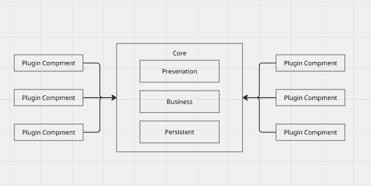

# ソフトウェアアーキテクチャの基礎 -エンジアリングに基づく体系的なアプローチ-
- Mark Richards, Near Ford 著
- 島田浩二 訳

## 12章: マイクロカーネルアーキテクチャ(プラグインアーキテクチャ)
- 製品化されたSWで採用されやすい
- 顧客側でinstallされ、モノシリックなアプリにfitする

### トポロジー
- アプリケーションロジックはCoreとPluginComponentによって分かれている
  - 拡張性、適応性、分離性に優れている

## コアシステム
- 必要最低限のハッピーパス(一般的な処理フロー)のみを実装
  - カスタムフローは個別のプラグインで実装
- 循環複雑度を上げずに、ロジックを分離して、拡張性もあげ
  - ex.デバイス依存の処理: ハードA, ハードB, ハードCごとのコンポーネントを作り、コアシステムからは同じI/Fで叩くようにする

- レイヤードコアシステム(技術による分割)

- モノリスコアシステム(ドメインによる分割)

- UIの置き場によるバリエーション
  - UIをコアシステム内で実装
  - UIをコアシステムとは切り離して、別ユニットとして実装
  - UIをコアシステムとは切り離して、マイクロカーネルとして別ユニットとして実装

## プラグインコンポーネント
- コアシステムを拡張、強化するための独立したコンポーネント
- 揮発性の高いコード分離し テスト容易性, 保守性をあげれる
- それぞれのコンポーネントには依存関係は存在しないのが理想
