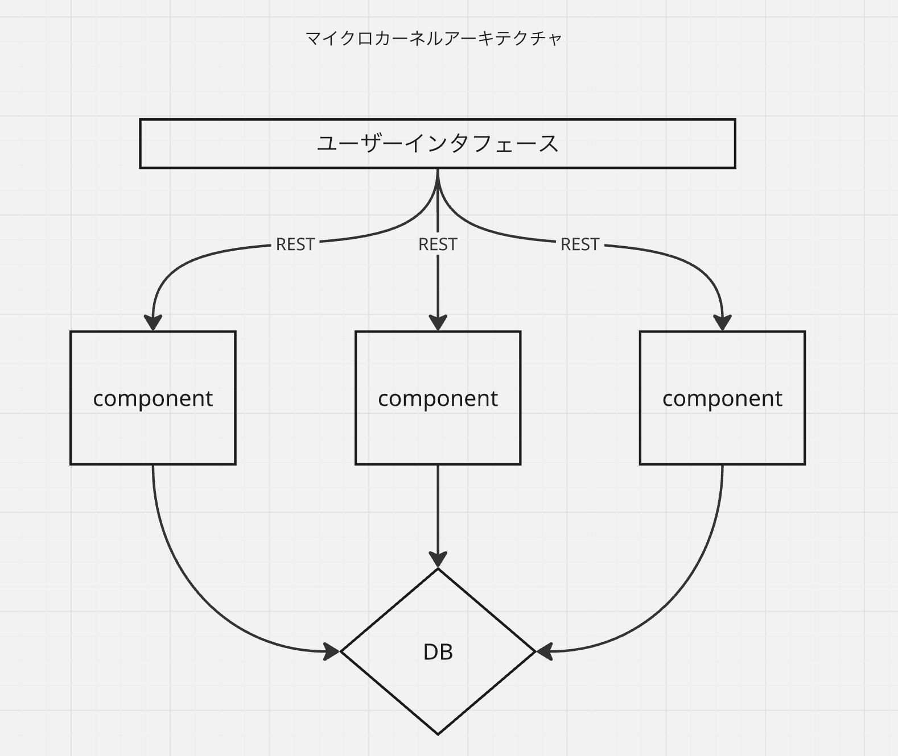

# ソフトウェアアーキテクチャの基礎 -エンジアリングに基づく体系的なアプローチ-
- Mark Richards, Near Ford 著
- 島田浩二 訳

## 13章: サービスベースアーキテクチャ
### トポロジー
- マイクロサービスアーキテクチャのハイブリット
- 柔軟性が高い
- 複雑性が低い

以下のように分割されデプロイされる
- UI
- サービスで割ったcomponent
- DB

基本的にはUIからcomponentのアクセスはRESTが利用される

