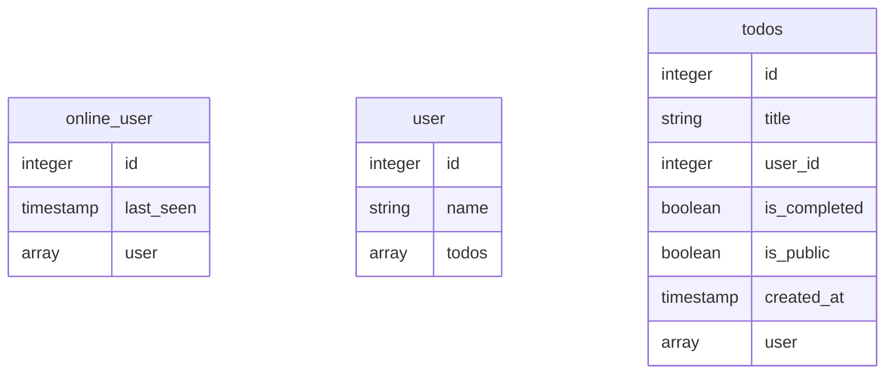

## データ取得: query
GraphQL APIを参照する時は、GraphiQL(グラフィカル)を使用するのが最も一般的


このようなスキーマがあった場合、すべてのユーザーと公開されているtodosが取得するクエリは以下
```
 query {
   users {
     name
     todos {
       title
     }
   }
 }
 ```

 現在オンライン中のオンラインユーザーと、そのプロファイル情報は以下

 ```
  query {
   online_users {
     last_seen
     user {
       name
     }
   }
 }
 ```

## GraphQLクエリへのパラメータ（引数）の追加
データ指定のために多くのAPI呼び出しでは、通常パラメータが使用される(ex. `GET /api/todos?limit=10`)
GraphQLクエリでは、「フィールド」に付加できる 引数がある。

```
query {
  todos(limit: 10) {
    id
    title
  }
}
```

異なるフィールドに引数を付与することもできる

```
query {
  users (limit: 1) {
    id
    name
    todos(order_by: {created_at: desc}, limit: 5) {
      id
      title
    }
  }
}
```

## GraphQL変数：クエリに動的に引数を渡します
$limit数のtodoを取得する場合

```
query ($limit: Int!) {
  todos(limit: $limit) {
    id
    title
  }
}
```

上記のクエリに加えて以下の変数オブジェクトも送信

```
{
   "limit": 10
}
```
